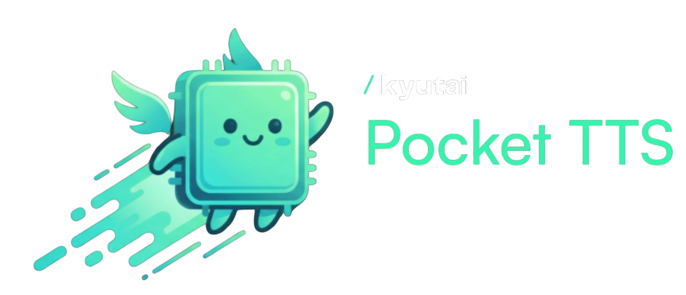

<p align="center">
  
</p>

<p align="center">
  <strong>Fast, local text-to-speech with voice cloning for Home Assistant</strong>
</p>

<p align="center">
  <a href="https://github.com/araa47/wyoming_pocket_tts/actions/workflows/on-merge.yml"></a>
  <a href="https://github.com/araa47/wyoming_pocket_tts/pkgs/container/wyoming_pocket_tts"></a>
  <a href="https://github.com/araa47/wyoming_pocket_tts/blob/main/LICENSE"></a>
  <a href="https://github.com/araa47/wyoming_pocket_tts/releases"></a>
</p>

<p align="center">
  A <a href="https://github.com/rhasspy/wyoming">Wyoming protocol</a> server for <a href="https://kyutai.org/tts">Kyutai Pocket TTS</a> — ~10x realtime on CPU, no cloud, no GPU.
</p>

---

## Features

- **Fast** — ~10x realtime on CPU, no GPU required
- **Voice Cloning** — clone any voice from 15-30 seconds of audio
- **Multi-language** — English, French, German, Portuguese, Italian, and Spanish
- **Local** — 100% on-device, no cloud dependency
- **Wyoming Compatible** — plug into Home Assistant voice pipelines
- **Preset Voices** — expanded Pocket TTS preset catalog across supported languages

## Quick Start

### Home Assistant Add-on

1. Go to **Settings > Add-ons > Add-on Store**
2. Click **...** > **Repositories** and add:
   ```
   https://github.com/araa47/wyoming_pocket_tts
   ```
3. Install **Wyoming Pocket TTS**
4. In **Configuration**, choose a `language` and set `voices`
5. Start the add-on
6. Add the discovered Wyoming device in **Settings > Devices & Services**

> First startup downloads the TTS model (~500 MB) and may take 3-5 minutes.
> Built-in voices do not require a Hugging Face token.

### Docker

```bash
docker run -d \
  --name pocket-tts \
  -p 10200:10200 \
  -v pocket-tts-voices:/share/tts-voices \
  ghcr.io/araa47/wyoming_pocket_tts:latest

# For voice cloning, add your HuggingFace token:
# -e HF_TOKEN=your_token_here
```

### Local Development

```bash
uv sync
uv run python -m wyoming_pocket_tts --voices alba --debug
```

## Requirements

| | |
|---|---|
| **Disk space** | ~1.5-2 GB (Docker image ~270 MB + model ~500 MB) |
| **Voice cloning** | Free [HuggingFace account](https://huggingface.co/join) with [accepted model terms](https://huggingface.co/kyutai/pocket-tts) |

> Built-in voices work without any HuggingFace setup. A token is only needed for voice cloning.

## Configuration

| Option | Default | Description |
|--------|---------|-------------|
| `language` | `en` | TTS language/model, selected from a dropdown |
| `voices` | `[alba]` | Voices to load. Each is **preloaded** (fast first response) and is the **only** set advertised to Home Assistant. Type a preset name or a custom sample's filename without extension (e.g. `rocky`). Leave empty to advertise every built-in + custom voice, loaded on demand |
| `voices_dir` | `/share/tts-voices` | Directory for custom voice samples |
| `hf_token` | — | HuggingFace token (custom/cloned voices only) |
| `debug` | `false` | Enable debug logging |

> **Using only a custom voice?** Put `rocky.ogg` in `/share/tts-voices`, set
> `hf_token`, set `voices` to `rocky`, pick the matching `language`, restart, then
> reload the Wyoming integration. Only `rocky` will be offered to Home Assistant.

## Voices

### Built-in Voices

| Language | Voice names |
|----------|-------------|
| English | `alba`, `anna`, `azelma`, `bill_boerst`, `caro_davy`, `charles`, `cosette`, `eponine`, `eve`, `fantine`, `george`, `jane`, `jean`, `javert`, `marius`, `mary`, `michael`, `paul`, `peter_yearsley`, `stuart_bell`, `vera` |
| French | `estelle` |
| German | `juergen` |
| Portuguese | `rafael` |
| Italian | `giovanni` |
| Spanish | `lola` |

### Custom Voice Cloning

> **Requires:** [HuggingFace token](https://huggingface.co/settings/tokens) with [accepted Pocket TTS model terms](https://huggingface.co/kyutai/pocket-tts).

1. Create `/share/tts-voices/` in Home Assistant if it does not exist
2. Record 5-30 seconds of clear speech; 15-30 seconds works best
3. Save it as `.ogg`, `.wav`, `.mp3`, `.flac`, or `.m4a`, for example `/share/tts-voices/rocky.ogg`
4. Add your Hugging Face read token to `hf_token`
5. Restart the add-on
6. Reload the Wyoming integration in Home Assistant:
   **Settings > Devices & Services > Wyoming Protocol > Pocket TTS > ... > Reload**
7. Use the voice by filename without extension, for example `rocky`

Custom voice samples are encoded by the selected `language` model. Pocket TTS
2.1.0 ships cloning-capable weight paths for the listed language configs. Those
weights are gated by Kyutai's Hugging Face model terms; if they cannot be
downloaded, preset voices still work and custom voices fall back to a preset with
a warning.

### Recording Tips

| Aspect | Recommendation |
|--------|----------------|
| **Length** | 15-30 seconds works best; minimum 5 seconds |
| **Quality** | 44.1 kHz, 16-bit, WAV or OGG preferred |
| **Content** | Natural conversation, not scripted |
| **Environment** | Quiet room, no echo |
| **Style** | Varied intonation with questions and statements |

## Languages

Set `language` in the add-on configuration or pass `--language` when running
locally. The default is `en`, so existing English and voice cloning setups keep
working without any configuration change.

| Code | Language | Default preset | Voice cloning |
|------|----------|----------------|---------------|
| `en` | English | `alba` | Supported with HF access |
| `fr` / `fr_24l` | French | `estelle` | Supported with HF access |
| `de` / `de_24l` | German | `juergen` | Supported with HF access |
| `pt` / `pt_24l` | Portuguese | `rafael` | Supported with HF access |
| `it` / `it_24l` | Italian | `giovanni` | Supported with HF access |
| `es` / `es_24l` | Spanish | `lola` | Supported with HF access |

**Example prompt:**
> "Hey, so I was thinking about dinner tonight. Maybe pasta? Or we could order something. What do you think? Oh, and don't forget we have that thing tomorrow morning."

## API

The server speaks [Wyoming protocol](https://github.com/rhasspy/wyoming) on TCP port `10200`.

```bash
# Health check
echo '{"type":"describe"}' | nc localhost 10200

# Synthesize speech
echo '{"type":"synthesize","data":{"text":"Hello world","voice":{"name":"alba"}}}' | nc localhost 10200
```

## Troubleshooting

<details>
<summary><strong>"Gated model" error (voice cloning only)</strong></summary>

Built-in voices don't require HuggingFace access. For voice cloning:

1. Go to https://huggingface.co/kyutai/pocket-tts
2. Log in and accept the model terms
3. Get your token from https://huggingface.co/settings/tokens
4. Add it to the add-on config as `hf_token`

</details>

<details>
<summary><strong>Custom voice not appearing in Home Assistant</strong></summary>

Home Assistant caches the voice list. After adding a new voice:

1. Restart the Pocket TTS add-on
2. Go to **Settings > Devices & Services > Wyoming Protocol**
3. Click on your Pocket TTS device > **...** > **Reload**

</details>

<details>
<summary><strong>Voice not found</strong></summary>

- Check the filename matches (without extension)
- Ensure the file is in the `voices_dir` path
- Check add-on logs for loading errors

</details>

<details>
<summary><strong>Slow first request</strong></summary>

Each voice loads on first use (~2s). Add voice names to `preload_voices` (one per line in the add-on UI) for instant first responses without loading every voice into RAM.

</details>

## License

MIT License — see [LICENSE](LICENSE).

Pocket TTS is licensed under CC-BY-4.0 with usage restrictions. See the [model card](https://huggingface.co/kyutai/pocket-tts) for terms.
